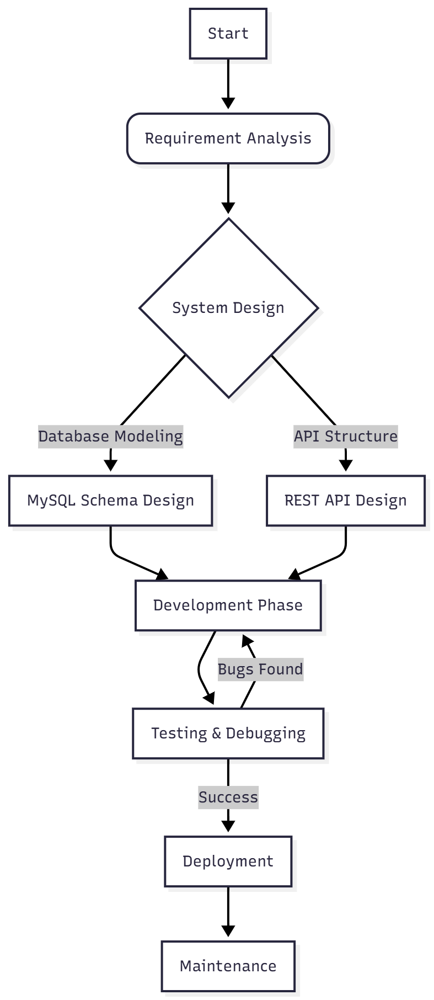
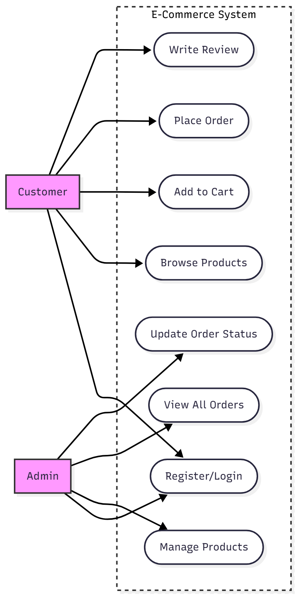
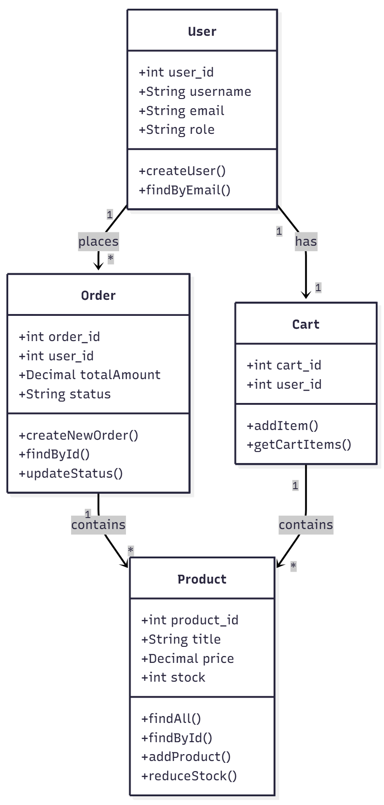
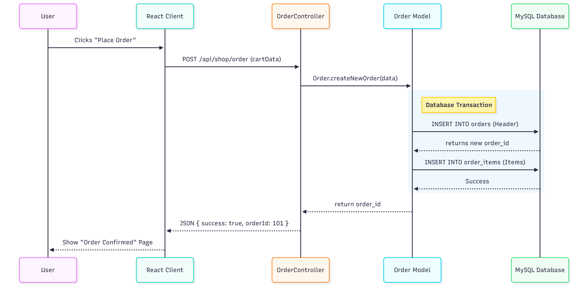
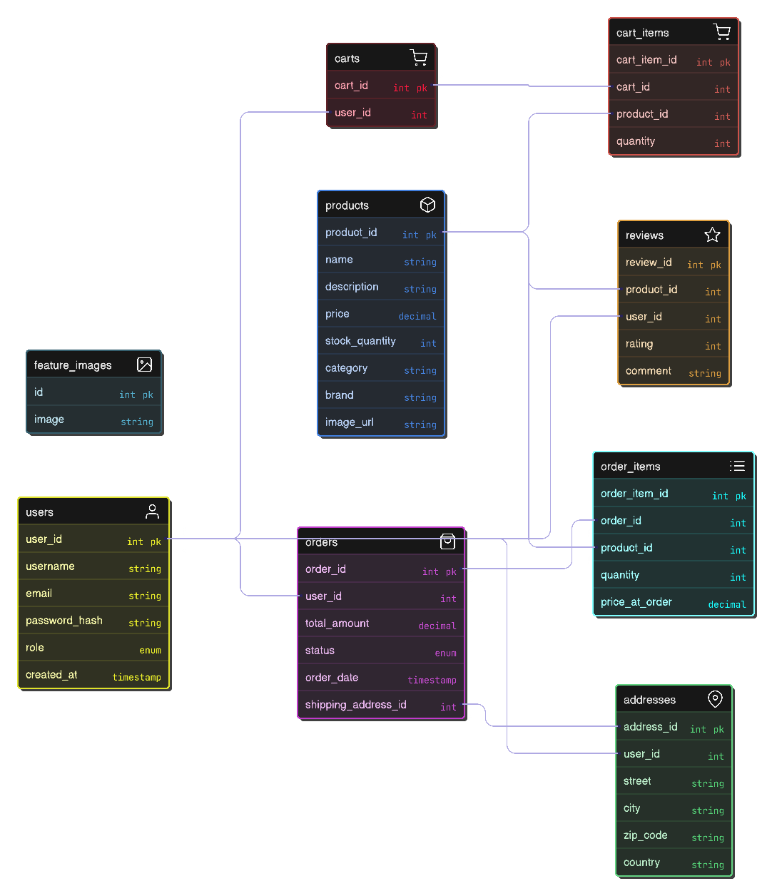

---

## 📖 Table of Contents

-  [Features](#-features)
-  [Tech Stack](#-tech-stack)
-  [SDLC Approach](#-sdlc-approach)
-  [UML Design](#-uml-design)
-  [Data Modelling & Schema Design](#-er-diagram)
-  [Cost & Effort Estimation (COCOMO Model)](#-cost-est)
-  [Getting Started](#-getting-started)
-  [License](#-license)

---

## Features <a name="-features"></a>

* **User Authentication:** Secure, stateless login using JWT with distinct **Admin** and **Customer** roles.
* **Smart Catalog:** Real-time product search, category filtering, and sorting powered by optimized SQL queries.
* **Order System:** Persistent database-backed shopping cart, address management, and integrated **PayPal** checkout.
* **Admin Dashboard:** Comprehensive interface for managing product inventory and tracking order fulfillment statuses.
* **Verified Reviews:** Logic ensuring only customers who have purchased a product can submit reviews.

## SDLC Approach: Agile Methodology <a name="-sdlc-approach"></a>

For the development of this E-commerce platform, the **Agile Software Development Life Cycle** was adopted. This iterative approach allowed for continuous development, frequent testing, and rapid adaptation to requirements, ensuring a robust and user-friendly final product.

The development process was divided into the following key phases:

#### 1\. Requirement Analysis & Planning

In this initial phase, the core functional and non-functional requirements were defined. The focus was on identifying the essential features required for a minimum viable product (MVP), including:

  * User Authentication and Role Management (Admin vs. Customer).
  * Product Inventory Management.
  * Shopping Cart logic and persistence.
  * Secure Order Processing and Payment Integration.

#### 2\. System Design & Database Modeling

This phase focused on architecting the backend and database structure. Given the transactional nature of e-commerce (orders, payments, inventory), a **Relational Database (MySQL)** was chosen to ensure ACID (Atomicity, Consistency, Isolation, Durability) compliance.

  * **ER Diagram Creation:** Defined entities like `Users`, `Products`, and `Orders` and established relationships (Foreign Keys).
  * **API Architecture:** Designed RESTful API endpoints for client-server communication.

#### 3\. Implementation (Development)

The coding phase followed a modular approach, separating the application into the Client (Frontend) and Server (Backend).

  * **Backend:** Developed using Node.js and Express, implementing the Controller-Service-Repository pattern. SQL queries were written to interact efficiently with the database.
  * **Frontend:** Built using React to create a dynamic Single Page Application (SPA).

#### 4\. Testing & Validation

Testing was conducted continuously alongside development:

  * **Unit Testing:** Individual API endpoints were tested using tools like Postman to ensure valid JSON responses and correct HTTP status codes.
  * **Integration Testing:** Verified that the frontend correctly communicated with the backend and that database transactions (e.g., placing an order) correctly updated multiple tables (Orders, Order Items, and Product Stock).

#### 5\. Deployment & Maintenance

The final phase involved configuring the environment variables, setting up the database connection pool for production, and deploying the application.


### SDLC Flow Diagram

Here is a diagram to visualize this process in your document:



## Tech Stack <a name="-tech-stack"></a>

* **Frontend:** React.js, Tailwind CSS
* **Backend:** Node.js, Express.js
* **Database:** MySQL (via `mysql2` driver)
* **Authentication:** JSON Web Tokens (JWT), Bcrypt.js
* **Integrations:** PayPal API (Payments), Cloudinary (Image Storage)
* **Tools:** Postman (API Testing), Git (Version Control)

***

---

## Unified Modeling Language (UML) Design <a name="-uml-design"></a>
Here is the professional Markdown content for your **UML Design** section. You simply need to paste your generated images where indicated.

---

## Unified Modeling Language (UML) Design

To visualize the system architecture and interactions, the following UML diagrams were designed to represent the functional requirements, static structure, and dynamic behavior of the E-commerce platform.

### 1. Use Case Diagram
The Use Case diagram provides a high-level overview of the system's functional requirements, defining the interactions between the primary actors (**Customer**, **Admin**) and the system.

* **Customer Actors:** Can register, browse products, manage their cart, place orders, and write reviews.
* **Admin Actors:** Have elevated privileges to manage product inventory, view all user orders, and update order statuses.



---

### 2. Class Diagram
The Class diagram illustrates the static structure of the backend system, mapping the relationship between our JavaScript Models and the underlying MySQL database tables.

* **Entities:** Represents core classes such as `User`, `Product`, `Order`, and `Cart`.
* **Methods:** Defines key behaviors like `findAll()`, `save()`, and `createOrder()`.
* **Relationships:** Shows how Users relate to Orders (One-to-Many) and how Carts contain Products (Many-to-Many).



---

### 3. Sequence Diagram (Order Processing)
The Sequence diagram details the dynamic flow of control for a critical business process: **Placing an Order**. It visualizes the timeline of interactions from the frontend user interface down to the database layer.

* **Flow:** The process begins with the User clicking "Place Order" on the React Client.
* **Transaction:** The `OrderController` calls the `OrderModel`, which initiates a MySQL transaction to create the Order Header and insert Order Items in a single atomic operation.
* **Response:** Upon database success, a confirmation ID is returned to the client.



---


## Data Modelling & Schema Design <a name="-er-diagram"></a>

The database for this e-commerce platform is designed using a **Relational Database Management System (RDBMS)** with a focus on data integrity, scalability, and normalization. The schema is visualized in the ER Diagram above, highlighting the following key architectural decisions:

* **Normalized Structure:**
    The database is structured to minimize redundancy. Instead of storing complex objects (like product details inside an order), we utilize distinct tables (`products`, `users`, `orders`) linked via relationships. This ensures that an update to a product's price or name is reflected system-wide without data duplication.

* **Relationship Mapping:**
    * **One-to-Many:** Implemented for users and their associated data. For example, a single `User` can have multiple `Addresses`, `Orders`, and `Reviews`.
    * **Many-to-Many:** Implemented for transactional data using junction tables. specifically `order_items` and `cart_items`. This allows a single Order or Cart to contain multiple Products, and a single Product to appear in multiple Orders.

* **Referential Integrity:**
    Foreign Keys (FK) are strictly enforced to maintain valid relationships between tables. For instance, an entry in the `reviews` table cannot exist without a valid `user_id` and `product_id`, preventing orphaned data.

* **Separation of Concerns:**
    * **Transactional Data:** The `orders` table stores the "header" information (status, total amount, shipping address), while `order_items` stores the specific line items. This optimizes query performance for order history views.
    * **Content Management:** The `feature_images` table is decoupled from the inventory logic, serving as a standalone resource for UI/Frontend content (such as banners and sliders), allowing for dynamic content updates without affecting product data.

* **Scalability:**
    The schema uses appropriate data types (e.g., `DECIMAL` for currency, `ENUM` for fixed statuses like 'pending'/'shipped') to ensure storage efficiency and precision in financial calculations.




---


## Cost & Effort Estimation (COCOMO Model) <a name="-cost-est"></a>

To estimate the development metrics, the **Basic COCOMO Model** was applied.

**Project Mode:** Organic (Small team, known environment).
**Code Size:** Estimated at **2 KLOC** (2,000 delivered lines of code, excluding libraries).

#### 1. Effort Calculation
Formula: $Effort (E) = 2.4 \times (KLOC)^{1.05}$

$$E = 2.4 \times (2)^{1.05}$$
$$E \approx 2.4 \times 2.07$$
$$E \approx 5.0 \text{ Person-Months}$$

*This indicates the project requires approx. 5 months of work if done by a single developer at standard industry pace.*

#### 2. Schedule & Duration Calculation
While the theoretical nominal time ($T = 2.5 \times E^{0.38}$) suggests ~4.5 months, the **Actual Schedule** was optimized to **1 Month** through the following factors:

* **Modern Stack Efficiency:** Use of high-level frameworks (React, Express) significantly reduced coding time compared to the COCOMO baselines.
* **Agile Iterations:** Rapid development sprints allowed for faster feature completion.
* **Parallel Execution:** (Assumption) A team size of ~4-5 members (or equivalent high-intensity individual effort) working in parallel.

**Actual Duration Calculation:**
$$Duration = \frac{\text{Total Effort}}{\text{Team Productivity Factor}}$$
$$Duration = \frac{5.0 \text{ Person-Months}}{5 \text{ (Effective Staffing)}}$$
$$Duration = 1 \text{ Month}$$

#### 3. Conclusion
The project was successfully completed in **1 Month**, effectively compressing the standard 5-month workload through the use of modern MERN+SQL stack efficiencies and an agile development approach.


## Getting Started <a name="-getting-started"></a>

First, install the dependencies. We recommend using `npm` for this project.

```bash
npm install
```

Then, run the development server:

```bash
npm run dev
# or
yarn dev
# or
pnpm dev
# or
bun dev
```

Open [http://localhost:3000](http://localhost:3000) with your browser to see the result.

You can start editing the page by modifying `app/(public)/page.js`. The page auto-updates as you edit the file.

This project uses [`next/font`](https://nextjs.org/docs/app/building-your-application/optimizing/fonts) to automatically optimize and load [Outfit](https://vercel.com/font), a new font family for Vercel.


## License <a name="-license"></a>

This project is licensed under the MIT License. See the [LICENSE.md](./LICENSE.md) file for details.
